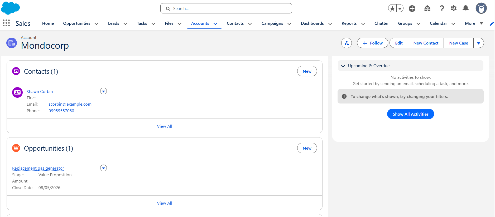
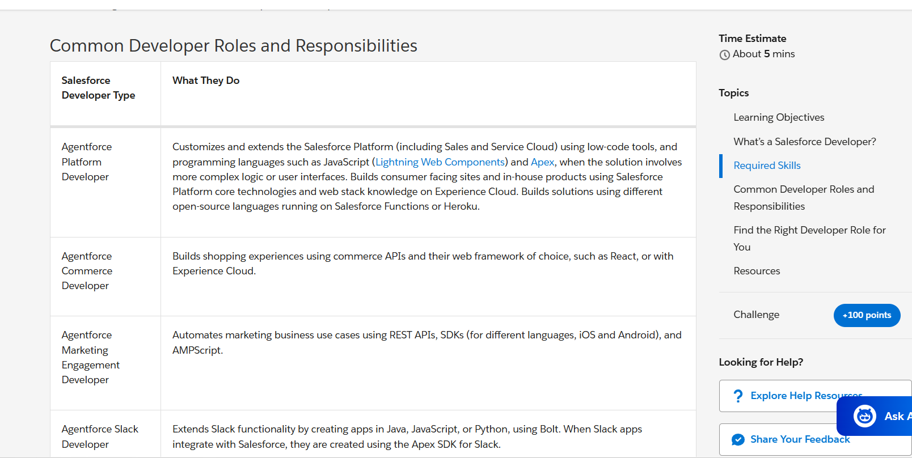
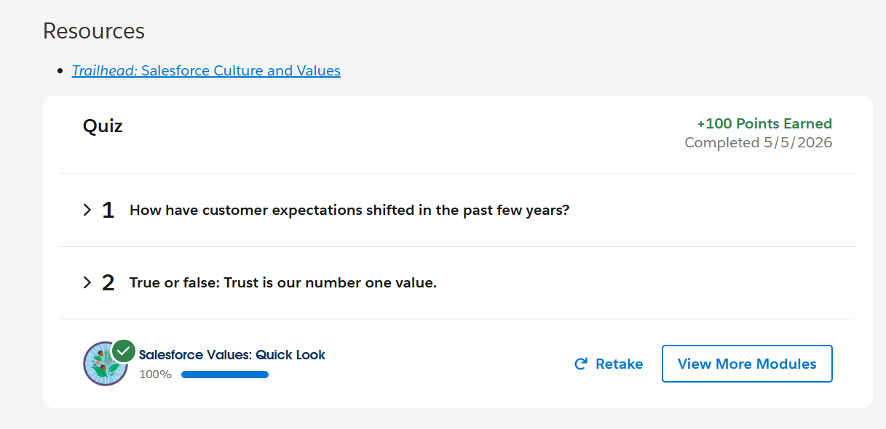

# 🚀 Salesforce Summer Program – Day 1

# 📘 Day 1 Notes – CRM Basics

## 1️⃣ What is CRM?

CRM stands for **Customer Relationship Management**.  
It is a system used by companies to manage customer data, communication, sales, and services in one place.

CRM helps businesses:
- Store customer information
- Track customer interactions
- Improve customer support
- Increase sales efficiency
- Build better customer relationships

One of the most popular CRM platforms is **Salesforce**.

---

## 2️⃣ Why Companies Use Salesforce

Companies use Salesforce because it helps them:
- Manage customer data efficiently
- Track sales opportunities
- Improve communication with customers
- Automate business processes
- Generate reports and analytics
- Increase productivity and sales

Salesforce is cloud-based, so employees can access data from anywhere.

---

# 3️⃣ Salesforce Objects

## 🔹 Account

An **Account** represents a company or organization.

### Examples:
- Infosys
- Amazon
- TCS

### It stores:
- Company name
- Industry
- Phone number
- Address

---

## 🔹 Contact

A **Contact** represents a person associated with an Account.

### Examples:
- Employee details
- Customer details
- Manager information

### It stores:
- Name
- Email
- Phone number
- Job title

---

## 🔹 Opportunity

An **Opportunity** represents a potential sales deal.

It helps companies track:
- Sales stage
- Expected revenue
- Closing date
- Deal status

### Example:
A company planning to buy software from Salesforce.

---

# 4️⃣ Real-World Mapping

| Real World | Salesforce Object |
|------------|------------------|
| College | Account |
| Student | Contact |
| Student Admission Process | Opportunity |

### Another Example

| Real World | Salesforce Object |
|------------|------------------|
| Company | Account |
| Employee/Customer | Contact |
| Business Deal | Opportunity |

---

# 📸 Screenshots

## Salesforce CRM

## Sales Developer Quick Look

## Sales Value Quick Look

---

# ✅ Conclusion

Day 1 helped me understand the fundamentals of CRM and Salesforce.  
I learned how Salesforce objects are used to manage customers, companies, and sales opportunities in real-world business environments.

## 📅 Status: ✅ Completed
