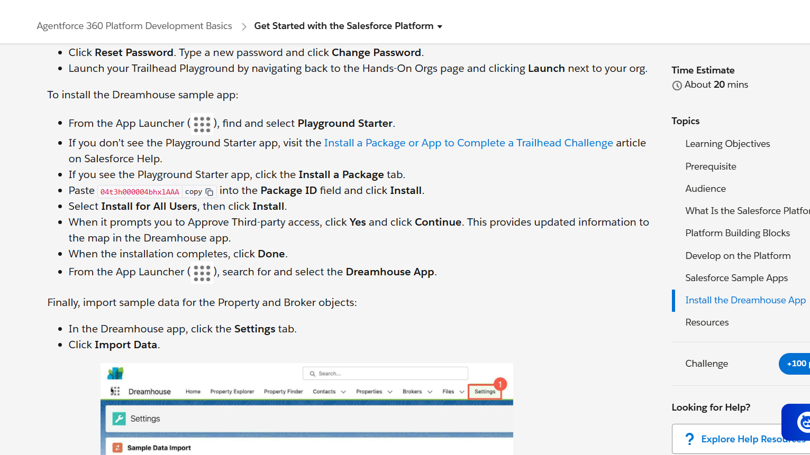
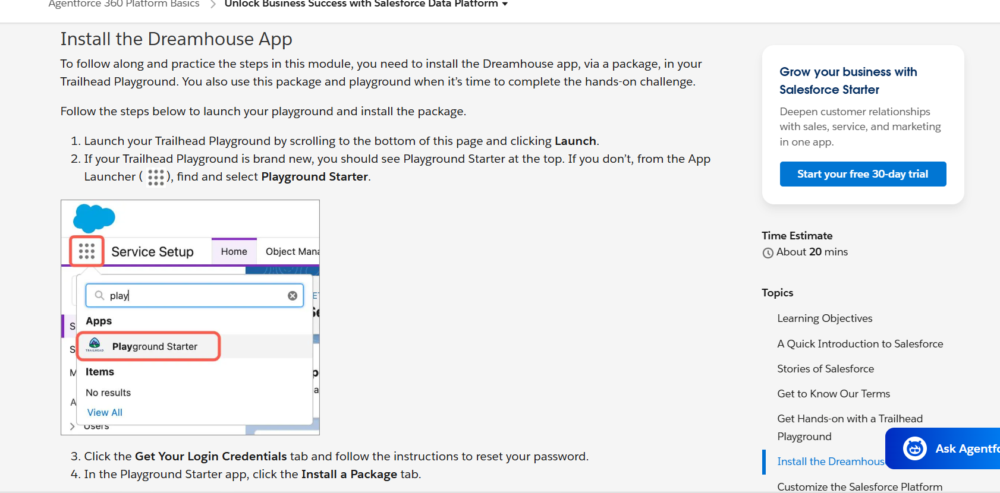

# Salesforce Platform – README

## 1️⃣ What is Salesforce Platform?

Salesforce Platform is a cloud-based platform used to build business applications without needing heavy hardware or software installation.

It helps companies to:

- Store customer data
- Automate business processes
- Manage sales and services
- Create custom applications
- Generate reports and dashboards

Salesforce works completely on the cloud, so users can access it from anywhere using the internet.

---

# 2️⃣ Explanation of Basic Terms

## 📌 App

An App in Salesforce is a collection of tabs, objects, and features grouped together for a specific purpose.

### Example:
A **College Management App** may contain:
- Student Tab
- Faculty Tab
- Attendance Tab
- Fees Tab

Apps help users work in an organized way.

---

## 📌 Object

An Object is like a database table used to store data.

Each object contains:
- Records (rows)
- Fields (columns)

### Types of Objects:
1. Standard Objects  
   - Already provided by Salesforce  
   - Example: Account, Contact, Opportunity

2. Custom Objects  
   - Created by users based on business needs  
   - Example: Student, Library, Hostel

### Example:
Student Object may contain:
- Student Name
- Roll Number
- Department
- Phone Number

---

## 📌 Tab

A Tab is used to access objects, reports, dashboards, or webpages in Salesforce.

Tabs make navigation easier.

### Example:
- Student Tab → Opens Student records
- Attendance Tab → Opens Attendance details

Without tabs, users cannot easily open objects.

---

# 3️⃣ Difference Between Configuration and Coding

| Configuration | Coding |
|---|---|
| Done using clicks | Done using programming |
| No programming knowledge required | Requires coding knowledge |
| Faster development | Takes more time |
| Easy to maintain | Needs developer support |
| Uses tools like Flow, Validation Rules | Uses Apex and Visualforce/LWC |

## Examples

### Configuration:
- Creating Objects
- Validation Rules
- Workflow Rules
- Reports

### Coding:
- Apex Classes
- Triggers
- Lightning Web Components

---

# 4️⃣ System Design

## 📚 Example Project: College Management System

### 📌 App Name
College Management App

---

## 📌 Objects Used

### 1. Student Object
Fields:
- Student Name
- Roll Number
- Branch
- Email
- Phone Number

### 2. Faculty Object
Fields:
- Faculty Name
- Subject
- Department

### 3. Attendance Object
Fields:
- Student Name
- Date
- Attendance Status

### 4. Fees Object
Fields:
- Student Name
- Amount
- Payment Status

---

# 🔄 User Interaction Flow

1. Admin logs into Salesforce
2. Admin opens College Management App
3. Admin adds Student details
4. Faculty updates Attendance records
5. Accounts department updates Fees
6. Students’ information is stored securely
7. Reports can be generated anytime

---

# ✅ Advantages of Salesforce Platform

- Cloud-based
- Easy to use
- Secure data storage
- Fast application development
- Mobile accessible
- Supports automation

---
# 📸 Screenshots

## Salesforce Platform Basics Notes

---

## Salesforce Platform Image

# 🎯 Conclusion

Salesforce Platform helps organizations create powerful applications with minimal coding. Using Apps, Objects, and Tabs, businesses can efficiently manage data and automate daily operations.

## 📅 Status: ✅ Completed
