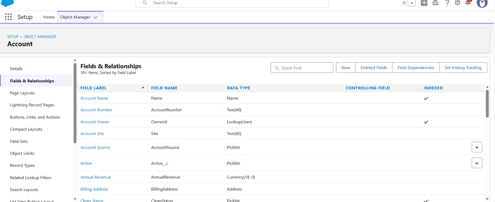
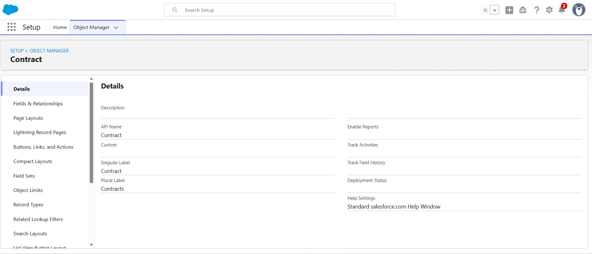
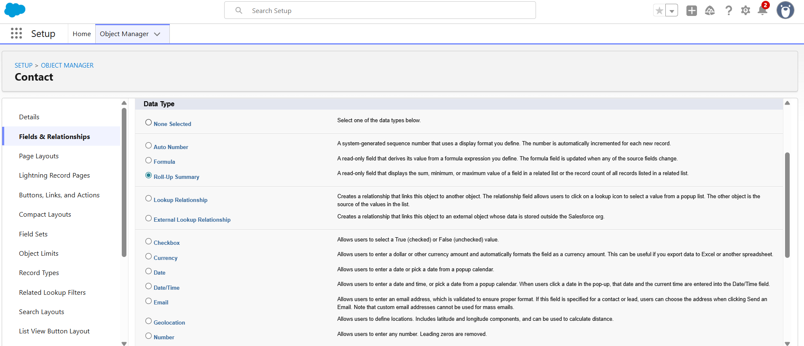
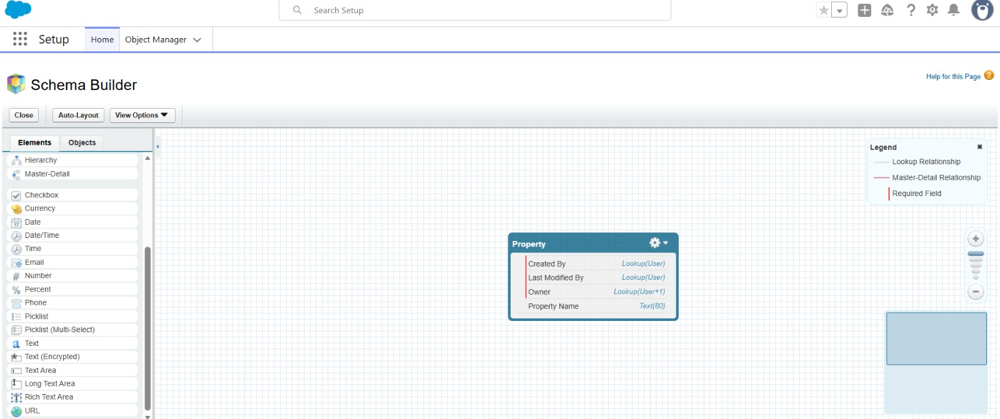

# Salesforce Summer Program – Day 3

# 📘 Data Modeling & Business Logic in Salesforce

---

# 📌 Introduction

In this task, I learned about Salesforce Data Modeling concepts such as:
- Objects
- Fields
- Records
- Relationships
- Formula Fields
- Validation Rules

I also understood how enterprise applications store and manage structured business data efficiently.

---

# 1️⃣ Difference Between App, Object, Record, and Field

| Term | Meaning | Example |
|------|----------|----------|
| App | Collection of tools/tabs used for a business purpose | Sales App |
| Object | Database table that stores data | Student Object |
| Record | Single row/data entry inside an object | Meghana student record |
| Field | Individual data value inside a record | Student Name |

---

# 2️⃣ Standard vs Custom Objects

## 🔹 Standard Objects

These are pre-built objects provided by Salesforce.

### Examples
- Account
- Contact
- Opportunity
- Lead

### Features
- Already available in Salesforce
- Used for common business processes
- Cannot be deleted

---

## 🔹 Custom Objects

These are user-created objects based on business requirements.

### Examples
- Student
- Faculty
- Course
- Department

### Features
- Created by users
- Fully customizable
- Used for specific business systems

---

# 3️⃣ College Management System Data Model

## 📌 Objects Created

1. Student  
2. Faculty  
3. Course  
4. Department  

---

## 📌 Relationships

| Parent Object | Child Object | Relationship Type |
|---------------|--------------|-------------------|
| Department | Faculty | Lookup |
| Department | Course | Lookup |
| Course | Student | Lookup |
| Faculty | Course | Lookup |

---

## 📌 Relationship Explanation

- One department can have many faculty members.
- One department can offer many courses.
- One course can contain many students.
- One faculty member can teach multiple courses.

---

# 📌 Data Model Diagram

```text
Department
   │
   ├── Faculty
   │
   └── Course
            │
            └── Student
```

---

# 4️⃣ Formula Fields

## 🔹 Formula Field 1 – Full Name

### Formula
```text
First Name + Last Name
```

### Why should this be automated?
It automatically combines first name and last name without manual typing.

---

## 🔹 Formula Field 2 – Remaining Seats

### Formula
```text
Total Seats - Enrolled Students
```

### Why should this be automated?
It automatically calculates available seats and reduces manual calculations.

---

## 🔹 Formula Field 3 – Percentage

### Formula
```text
(Obtained Marks / Total Marks) * 100
```

### Why should this be automated?
It automatically calculates percentage accurately for every student.

---

# 5️⃣ Validation Rules

## 🔹 Validation Rule 1 – Email Cannot Be Empty

### Purpose
Prevents saving student records without email.

### Problem Prevented
Avoids missing communication details.

---

## 🔹 Validation Rule 2 – Student Age Cannot Be Negative

### Purpose
Blocks invalid age values.

### Problem Prevented
Maintains correct student information.

---

## 🔹 Validation Rule 3 – Course Seats Cannot Exceed Limit

### Purpose
Prevents entering seats beyond allowed capacity.

### Problem Prevented
Avoids incorrect course allocation.

---

# 6️⃣ Reflection – Why Structured Enterprise Data Matters

Companies use structured data because:
- It keeps information organized
- Data can be searched quickly
- Relationships between data are maintained properly
- Reports and dashboards become accurate
- Duplicate and inconsistent data can be reduced
- Automation becomes easier

Random spreadsheets create confusion, duplication, and errors when data becomes large.

---

# ✍️ Reflective Questions

## 1. Why can’t companies manage everything using Excel sheets?

Excel sheets become difficult to manage when data grows large.  
They can create duplicate records, errors, and security problems.

---

## 2. Why are relationships important between objects?

Relationships connect related business data together.  
They help companies track information efficiently.

---

## 3. What problems happen if data is inconsistent?

- Wrong reports
- Duplicate records
- Business confusion
- Incorrect decision-making

---

## 4. Why should repetitive calculations be automated?

Automation:
- Saves time
- Reduces human errors
- Gives accurate results instantly

---

## 5. Why should invalid data be blocked early?

Blocking invalid data improves data quality and prevents future problems.

---

## 6. Why is Salesforce called a metadata-driven platform?

Because Salesforce applications are built using configuration and metadata instead of heavy coding.

---
# Screenshots

## 1. Accounts Page


## 2. Contracts Page


## 3. Roll-Up Summary Fields


## 4. Schema Builder

# ✅ Conclusion

This Day 3 task helped me understand:
- Salesforce data structure
- Objects and relationships
- Formula Fields
- Validation Rules
- Importance of structured enterprise systems

---
## 📅 Status: ✅ Completed
